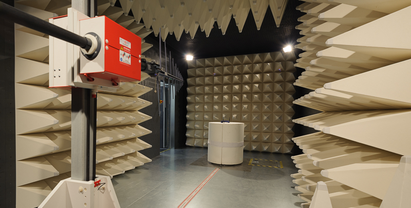

# EIRP
Equivalent isotropic radiated power automation scripts in Python.

Calibration and measurement with R&S signal generator, R&S spectrum analyser and a Frankonia anechoic chamber controlled with a FC-06 (Antenna mast and turntable).

Needed:
- Python 2.7
- Numpy
- PyVisa
- Matplotlib

`Calibration.py` performs the calibration of the chamber and renders the radiation pattern.

`EIRP.py` performs the measurement (3 cutting planes).

`EIRP_light.py` allows to choose the cutting plane and the polarization by completing a (polarisation x cutting planes) matrix.

`SignalGenerator.py`, `Spectrum.py`, `FC06.py` are instrument classes containing the basic functions to perform a complete measurement.
